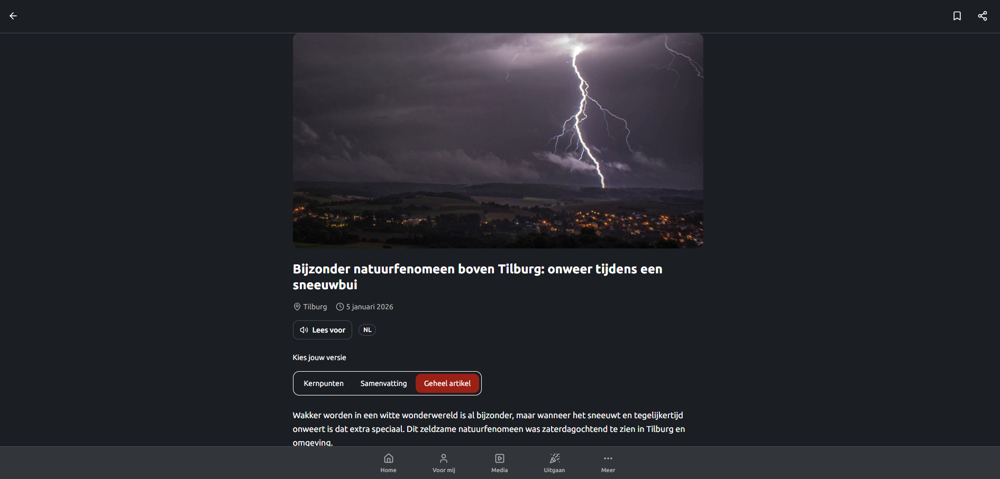

# Omroep Brabant – Personalized News App (Prototype)


---

## 📰 Overview

This project is a **front-end prototype** for Omroep Brabant, focused on **personalized regional news**. Users can configure their preferences based on **location, radius, and themes**, after which they receive a personalized news feed and a **weekly recap**.

The main focus of this project is **UX design, front-end architecture, and personalization logic**. The backend is developed by another student; therefore, this prototype currently works with **mock data** that mirrors the structure of the expected backend API.

---

## ✨ Key Features

- Intro flow before personalization
- Location setup (manual region selection or live GPS location)
- Radius-based filtering
- Support for multiple saved locations (e.g. home, work)
- Theme selection (News, Sports, Culture, etc.)
- “For You” page with personalized articles
- Weekly recap grouped by theme
- User preferences stored client-side (localStorage)
- Responsive layout inspired by Omroep Brabant styling

---

## 🖼️ Screenshot



---

## 🔧 Setup Instructions

### 1. Clone the repository

```bash
git clone https://github.com/cindybruikman/ob-prototype.git
cd ob-prototype
```

---

### 2. Install dependencies

```bash
npm install
```

---

### 3. Start the development server

```bash
npm run dev
```

Open the app in your browser:

👉 [http://localhost:3000](http://localhost:3000)

---

## 🧠 Architecture & Data Flow

### Front-end stack

- **Next.js (App Router)**
- **React + TypeScript**
- **Tailwind CSS**
- **LocalStorage** for persisting user preferences

### Data handling (prototype)

- Articles are loaded from `mockDataBackend`
- Backend-shaped data is converted to UI-friendly models via `mapBackendToUI`
- User preferences are managed in `preferences.ts`
- Article filtering happens fully client-side based on preferences

> The application is prepared for real backend integration, but currently runs independently using mock data.

---

## 🧪 Testing

You can test different personalization scenarios by:

- Switching between live location (GPS) and manual region selection
- Adjusting the location radius
- Selecting and deselecting themes
- Checking how the **For You** page and **Weekly Recap** update accordingly

---

## 🛠 Available Scripts

| Command         | Description                  |
| --------------- | ---------------------------- |
| `npm run dev`   | Start development server     |
| `npm run build` | Build the app for production |
| `npm run start` | Run the production build     |
| `npm run lint`  | Lint the codebase            |

---

## 📌 Project Status

This project is a **functional front-end prototype** developed as part of a graduation project. It demonstrates personalization logic, UX decisions, and scalable front-end structure, but is **not intended as a production-ready application**.

---

## 📄 License

MIT License
